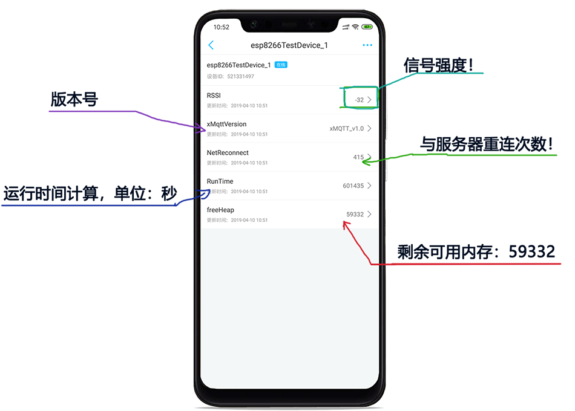

## `xMqttEsp8266Rtos3.1Lib`

----------
### 一、前言；

 - 对于2018年乐鑫出来的`esp-idf`框架的`rtos 3.0`版本全面改革，很多接口已经大大的修改了！这是个好事，说明官方在努力地做适配，的确，这个版本的内存足足省下了 10k 左右！对于 `esp8266` 来说，无疑是一个里程碑！

 - 本人半颗心脏在总结一些以往 `esp8266`的开发经验，把 这个 `MQTT`连接的断线重连不泄露内存等问题的框架弄好了！**下面是这个框架的一周多运行时间的状态上报的可视化界面！** 具体的上报看使用demo代码！
 
 - 技术讨论进付费QQ群：434878850  ， 如需源码联系：870189248@qq.com

----------

  

----------
### 二、如何使用；

- 正在整理！
